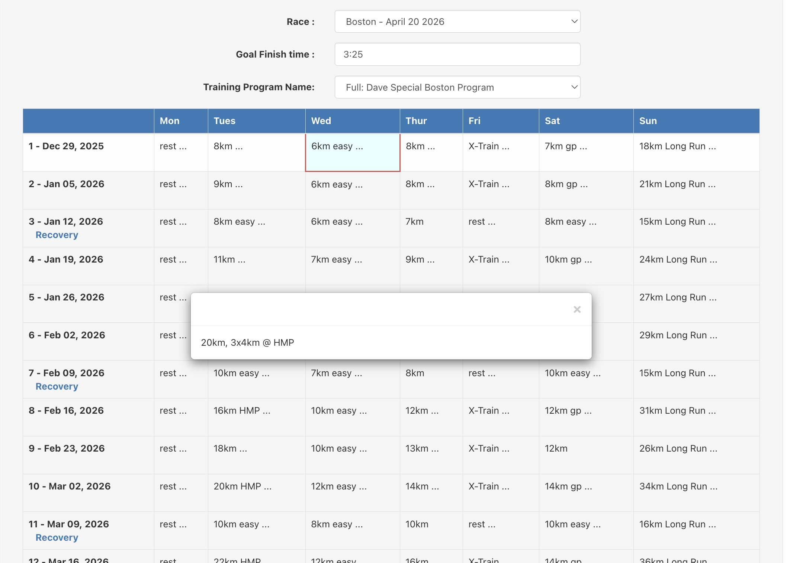
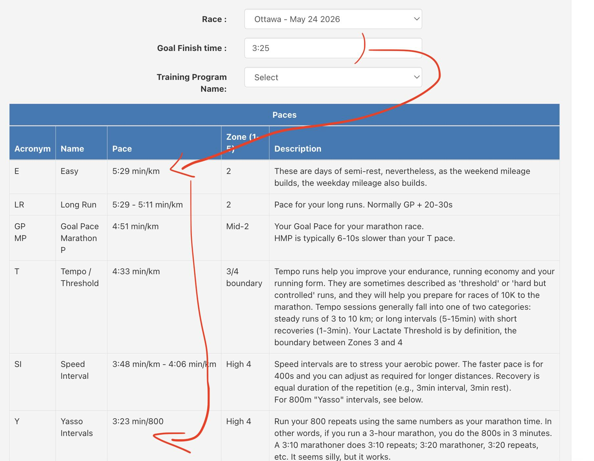

##  Marathon Training Program

This provides a _simple_ web-based tool for running clubs to post **marathon training programs** to the web for their members. The plans auto-adjust to fit upcoming race dates.

The program also provides you a with **training paces** based on your goal race pace.

The tool is trivial to install: just unzip the files into your website, and possibly updating a text file of race dates. (You do not need any CGI/WSGI or any other tools.)

_Training Plan_   

_Training Paces_  

### Installing
Just unzip the latest release into your website.

### Adding Races
- Races can be added to the `src/public/races.json` file before building, but the races.json file is separate in the built version, so it can be added after the fact to update races every year without having to rebuild the application.

### Adding Training Programs
Like races, training programs can be added to the live deployment.
- Training programs can be added to `src/public/programs/<program>.json` .
- You must also update the index in `src/public/programs/programs.json` .
